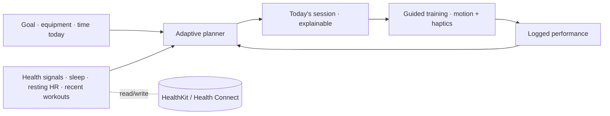

# FitMind AI

*An adaptive AI fitness coach — your plan bends to your day, not the other way around.*

> A studio flagship by Shubham Hingne — a senior product engineer building production mobile
> products end-to-end. Held to the engineering discipline of
> [Engineering OS](../engineering-os/), with a higher bar for UI/UX craft.

## The problem

Most fitness apps hand you a fixed plan, then can't respond when you sleep badly, travel, miss a
day, or only have twenty minutes. Adherence collapses — and people blame themselves for an app
that was never designed to adapt to them.

## The idea

**Yesterday changes today.** FitMind AI generates each session from your goal *and* your recent
performance, recovery, and available time — then guides it with App-Store-grade motion and
haptics. Your health data doesn't just sit in a dashboard; it changes tomorrow's workout.

## Status

Phase 1 — **Product Discovery**. No code yet; the product is being defined before it is built
(the same discipline used on Engineering OS). Read the thinking:

- [Product vision](docs/01-product/01-product-vision.md)
- [PRD](docs/01-product/02-prd.md) — MVP scope, deliberately small
- [Personas](docs/01-product/03-personas.md)
- [User stories](docs/01-product/04-user-stories.md)

## Roadmap (lifecycle)

| Phase | Focus | State |
|---|---|---|
| 1 · Discovery | Vision · PRD · Personas · Stories | 🟡 in progress |
| 2 · Design | Design system · wireframes · hi-fi UI · prototype | ⏳ |
| 3 · Build | Flutter app · adaptive engine · Health adapters · state mgmt | ⏳ |
| 4 · Hardening | Tests · accessibility · performance · CI/CD | ⏳ |
| 5 · Ship | Demo video · case study · release | ⏳ |

## Engineering focus

This flagship's deliberate skill emphasis: **AI + premium animation + Health-platform
integration** — the three hardest things to fake and the most visible to a senior reviewer.

## License

MIT — see [LICENSE](LICENSE).
