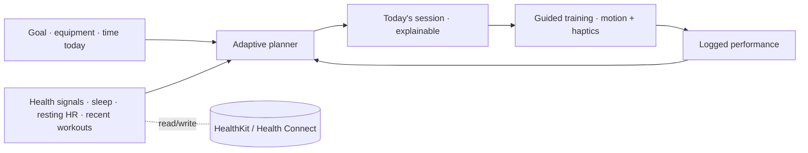

# FitMind AI

*The fitness app that adapts every day — not every month.*

> A studio flagship by Shubham Hingne — a senior product engineer building production mobile
> products end-to-end. Held to the engineering discipline of
> [Engineering OS](../engineering-os/), with a higher bar for UI/UX craft.

## The problem

Most fitness apps hand you a fixed plan, then can't respond when you sleep badly, travel, miss a
day, or only have twenty minutes. Adherence collapses — and people blame themselves for an app
that was never designed to adapt to them.

## The idea

**It adapts every day, not every month.** Most apps hand you a fixed plan; FitMind generates each
session from your goal, your recent performance, and the time you actually have *today* — then
guides it with App-Store-grade motion and haptics. *(Internally: recovery + performance + sleep +
time-available → today's workout. Externally: it just fits your day.)*

## Status

Phase 2 — **Design System** (mobile-first). The product is fully defined; the design language is
being established before any code. Read the thinking:

- **Product:** [vision](docs/01-product/01-product-vision.md) · [PRD](docs/01-product/02-prd.md)
  (delight-first MVP) · [personas](docs/01-product/03-personas.md) ·
  [user stories](docs/01-product/04-user-stories.md)
- **Design:** [principles](docs/03-design-system/01-design-principles.md) ·
  [tokens](docs/03-design-system/02-design-tokens.md) ·
  [screen inventory](docs/03-design-system/03-screen-inventory.md) ·
  [signature moments](docs/03-design-system/04-signature-moments.md) ·
  [workout player spec](docs/03-design-system/05-workout-player.md) ·
  [haptic language](docs/03-design-system/06-haptic-language.md) ·
  [emotional design](docs/03-design-system/07-emotional-design.md)
- **Build (started — signature screen first):** [`app/`](app/) — the Workout Player's architecture
  authored against the spec (custom-painted ring · state machine · haptics). Compile/profile/demo
  on-device.

## Roadmap (lifecycle)

| Phase | Focus | State |
|---|---|---|
| 1 · Discovery | Vision · PRD · Personas · Stories | ✅ done |
| 2 · Design | Design system · signature moments · player spec · emotional design | 🟡 in progress |
| 3 · Build | **Workout Player first** (authored) → compile · profile 60fps · demo, then the rest | 🟡 started |
| 4 · Hardening | Tests · accessibility · performance · CI/CD | ⏳ |
| 5 · Ship | Demo video · case study · release | ⏳ |

## Quality bar

> Every screen must look at home beside Apple Fitness, Nike Training Club, or Whoop — and earn
> one "wow" moment. *No Generic Screen.*

## Engineering focus

This flagship's deliberate skill emphasis: **AI + premium animation + Health-platform
integration** — the three hardest things to fake and the most visible to a senior reviewer.

## License

MIT — see [LICENSE](LICENSE).
